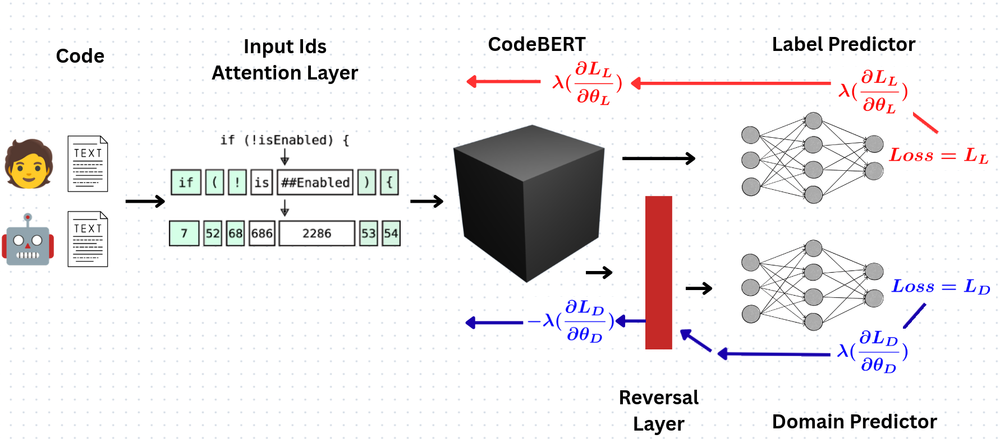

# code-detect-Semeval2026

 The Team ***LATE-IIMAS*** competed in the international shared task ***SemEval-2026-Task13***: "Detecting Machine-Generated Code with Multiple Programming Languages, Generators, and Application Scenarios". For the 2026 edition, this task has three subtasks.
 - ***Task A***: Identify if a given code is fully either (i) human-written or (ii) fully machine-generated.
 - ***Task B***. Predict if the origin of a given code snippet is (i) fully human-written or (ii-xi) generated by one of the following families: ***DeepSeek, Qwen, 01-ai, BigCode, Gemma, Phi, Meta-LLaMA, IBM-Granite, Mistral, or OpenAI***.
 - ***Task C***. Classify a given code snippet into one of four categories: (i) fully human-written, (ii) fully machine-generated, (iii) Hybrid, or (iv) Adversarial.

More information about it and the training, validation, and test datasets can be downloaded from the following webpage: [Kaggle: SemEval-2026-Task13](https://www.kaggle.com/datasets/daniilor/semeval-2026-task13).

 We used four independent systems to solve this classification problem: Graph Neural Network (***GNN***), Pre-trained Language Model (***PLM***), Large Language Model (***LLM***), and Stylometry. Each folder contains the Python code to run a specific experiment.
 - gnn
 - dann (PLM)
 - dann_cascade (PLM)
 - LLM
 - Stylometry
## gnn
## dann and dann_cascade
These folders showcase the PLM method: a "Domain Adversarial Neural Network" using codeBERT (an encoder capable of understanding natural language and programming language), used to solve task A (dann), task B (dann_cascade), and task C (dann).

The src subfolder contains three core scripts: train.py, predict.py, and error_analysis.py. Each script integrates with ***Weights & Biases***, a machine learning platform used to log model states and visualize training curves. To use these scripts, you will only need to create a free W&B account.

***train.py***: trains the model. To run this code, you will have to give: ***train_path*** (local path to the specific training dataset task stored in parquet format), ***val_path*** (local path to the validation dataset stored in parquet format), ***name_run*** (name of the run), and if dann_cascade ***binary*** (a number to indicate if it is binary -0- or multiclass -1-). You can also change some hyperparameters, e.g., the number of epochs, batch size, max_length, and learning rate.

bash

***Example*** python ./train.py \--train_path ./training_path.parquet \--val_path ./validation_path.parquet \--name_run "name_of_the_run"

***Example*** python ./train.py \--train_path ./training_path.parquet \--val_path ./validation_path.parquet \--name_run "name_of_the_run" \--binary 0

***predict.py***: from the training data restores the structure, and from the wand platform, gets the state of the trained DANN model, then predicts the test dataset, and stores the prediction in a .csv file. To run this code, you will have to provide: ***train_path*** (local path to the specific training dataset task stored in parquet format), ***test_path*** (local path to the test dataset stored in parquet format), ***output_path*** (local path in which you want to store the .csv file), ***artifact_name*** (the artifact name of the wandb run), and if dann_cascade ***artifac_name2*** (the second artifact name of the wandb run).

bash

***Example*** python ./predict.py \--train_path ./training_path.parquet \--test_path ./test_path.parquet \--artifact_name "name_of_the_artifact" \--output_path output_path.csv

***Example*** python ./predict.py \--train_path ./training_path.parquet \--test_path ./test_path.parquet \--artifact_name "name_of_the_artifact" \--artifact_name2 "name_of_the_second_artifact" \--output_path output_path.csv

***error_analysis.py***: compares the prediction stored in the .csv file with the original dataset and performs the calculation of accuracy, precision, recall, and f1-score. Produces the confusion matrix, makes distribution histograms for the errors, and stores them in an output folder.

bash

***Example*** python ./error_analysis.py \--prediction_path ./prediction_path.csv \--test_path ./test_path.parquet \--output_path output_folder/

## LLM
We use the LLM Command A from Cohere to tackle subtask A. We extract two examples from the training data set and use them as prompts for each classification.
## Stylometry
